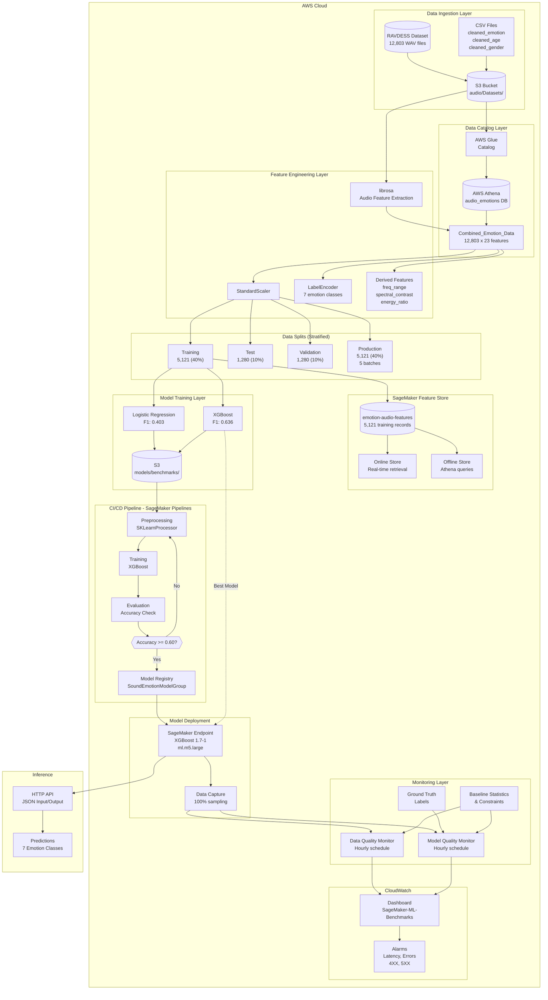
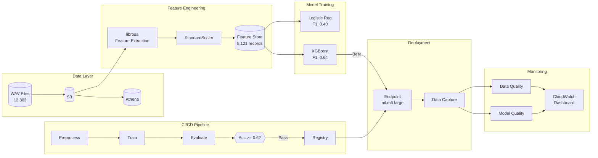
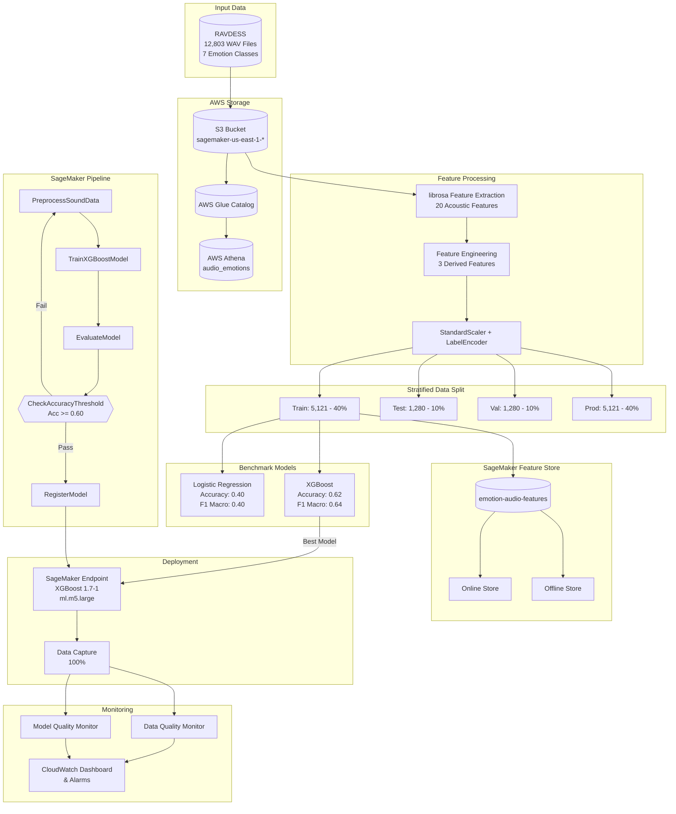
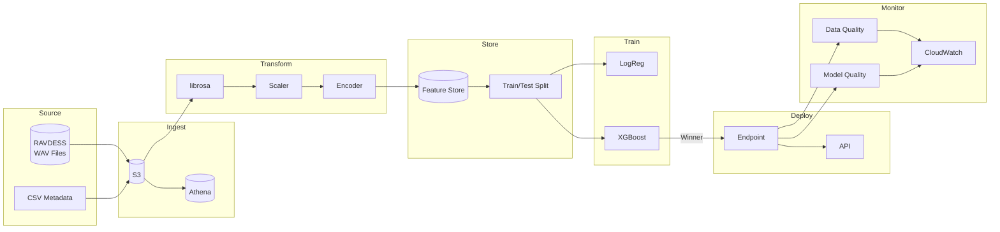

# AAI-540 Emotion Classification MLOps Architecture

## Full Architecture Diagram

## Simplified Architecture Diagram

## Top-Down Pipeline View

## Horizontal Data Flow

## Component Details

### Data Sources
- **RAVDESS Dataset**: 12,803 audio samples across 7 emotion classes
- **Emotion Classes**: Angry, Happy, Sad, Fearful, Disgusted, Neutral, Surprised
- **Class Imbalance**: Surprised (4.62%) vs others (14-17%)

### Feature Engineering
- **20 Acoustic Features**: meanfreq, sd, median, q25, q75, iqr, skew, kurt, sp_ent, sfm, mode, centroid, meanfun, minfun, maxfun, meandom, mindom, maxdom, dfrange, modindx
- **3 Derived Features**: freq_range, spectral_contrast, energy_ratio
- **Preprocessing**: StandardScaler (fit on train), LabelEncoder (0-6)

### Model Performance
| Model | Accuracy | F1 Macro | Training Time |
|-------|----------|----------|---------------|
| Logistic Regression | 0.403 | 0.403 | 6.54s |
| **XGBoost** | **0.621** | **0.636** | 4.68s |

### Monitoring
- **Data Quality**: Hourly checks against baseline statistics
- **Model Quality**: Hourly checks with ground truth comparison
- **CloudWatch**: Dashboard with latency, error, and violation metrics
- **Alarms**: High latency (>10s), Invocation errors (>5), 4XX/5XX errors
